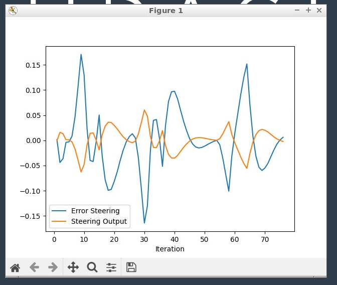
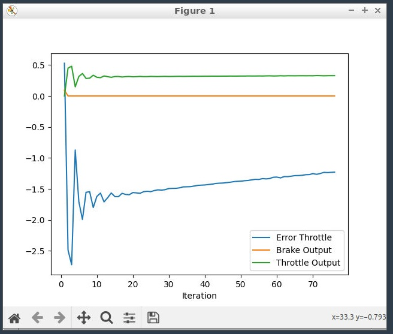

# Project Writeup

The screenshot below shows the steering output and the error. The error is defined as the difference between the actual measurement versus the desired one (e.g. target_angle-measured_angle). To determine the desired steering, you can add the two plots together. For steering, the errors fluctuate around 0, in some cases with the desired steering angle being greater than the actual steering angle and in other cases being lower than the actual steering angle. Ideally, the error hugs the horizontal line around y = 0, which it is close to doing in this case. This means the PID controller is doing a good job controlling the steering.

The plot below shows the throttle and brake output commands per iteration and the throttle error. The throttle error is decreasing as the iterations increase, due to the I component of the PID controller, which sums all the errors and subtracts it from the control value in order to minimize the error. This is the point of the PID controller -- to minimize the error over many iterations. The throttle error can be minimized further through parameter tuning, like through Twiddle.

The PID controller tells each command (break, steer, and throttle) how to reach the desired state given the current state in a smooth fashion. It minimizes the error in each iteration. Specificallly, it will use the delta of the desired and actual measurements (P), the difference between the last error and the current error (D), and the sum of the previous errors (I), and take a weighted sum based on the PID coefficients to produce the control value (e.g. steering angle, throttle value). 

The P value is proportional to how far away you are to your target distance, so that farther distances will correspond to a great P value. The I value makes sure you are constantly making your way closer to the target value in case of noise in the measurements that you are using, and the D is responsible for ensuring a smooth transition to that value, without overshooting it. The D part of the PID controller subtracts the derivative of the last two errors to ensure the errors don't decrease too quickly, causing sharp deltas in the control values and the overshooting of the target value.

You can use twiddle to help tune the parameters to an optima. Twiddle is done by holding all other parameters constant besides one, incrementing/decrementing that one, and finding the value which minizmes the error. It is then repeated for all parameters.

The pros of a model free controller is that it is more generalizable to other tasks, because it is not specific to the car. We can use the same controller to control the sterring angle, throttle value, and break value. This is easier and more maintanable than having to build seperate controllers for each control on our car. However, building a model-free controller means we can not tailor it to the specific details of the car, which slightly reduces accuracy than if we were to build a model-specific controller.